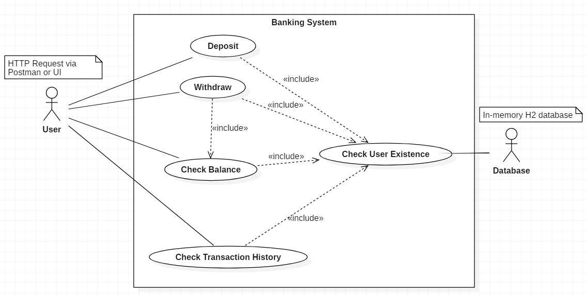

<h1>Banking System Approach</h1>

This project implements a simple banking system with features like deposit, withdrawal, balance inquiry, and transaction history retrieval through an HTTP server.
<br>
A minimal user interface is implemented for testing purposes.
<br>
<br>

<h2>Use Case Diagram</h2>
The following use case diagram summarizes the possible transactions that can be performed with the banking system.<br>

<br></img>
<br>


<h2>Project Structure</h2>
The project consists of several packages:
<ul>
    <li><b>handlers:</b> Contains classes that handle HTTP requests.</li>
    <li><b>model:</b> Defines the data models used in the system, such as Client, Account, Transaction, and Message.</li>
    <li><b>parsers:</b> Provides classes for parsing JSON data.</li>
    <li><b>server: </b> Contains the main class (BankingServer) that initializes and starts the HTTP server.</li>
    <li><b>service:</b> Implements services for database initialization (DatabaseInitializer) and transaction handling (TransactionService).</li>
    <li><b>user:</b> Defines the user interface (User) for interacting with the banking system and the Response class for handling server responses.</li>
</ul>
<br>

<h2>Setup and Execution</h2>
<b>Database Initialization:</b> The H2 in-memory database is used for this project. The DatabaseInitializer class initializes the database with sample data. This is done by creating tables for clients, accounts, and transactions, and then inserting sample data.<br>
<br><b>Server Initialization:</b> The main class BankingServer initializes and starts the HTTP server. It listens on port 9090 and handles requests at the "/api/request" endpoint.<br>
<br><b>User Interface:</b> The User class represents a simple Swing GUI for users to interact with the banking system. Users can perform actions like deposit, withdrawal, balance inquiry, and transaction history retrieval.<br>
<br>

<h2>Database Content</h2>
<p>To facilitate testing, the following users and transactions have been added to the database:</p>
<ol>
    <li><b>Client John Doe (Account Number 123):</b>
        <p>* First Name: John</p>
        <p>* Last Name: Doe</p>
        <p>* Age: 30 years</p>
        <p>* Account Balance: 1000</p>
        <p>* Transactions:</p>
        <p>&emsp;&emsp;+ Deposit of 500</p>
        <p>&emsp;&emsp;- Withdrawal of 200</p>
    </li>
    <li><b>User Alice Smith (Account Number 456):</b>
        <p>* First Name: Alice</p>
        <p>* Last Name: Smith</p>
        <p>* Age: 25 years</p>
        <p>* Account Balance: 500</p>
        <p>* Transactions: 0 transactions</p>
    </li>
</ol>


<h2>Class Descriptions</h2>
<h3>Handlers</h3>
<li><b>RequestHandler:</b> Handles HTTP requests for deposit, withdrawal, balance, and history retrieval.</li>
<li><b>WithdrawalRequestHandlerImpl:</b> Implements the withdrawal request handling logic.</li>

<h3>Model</h3>
<li><b>Account:</b> Represents a bank account with an account number, balance, and transaction history.</li>
<li><b>Client:</b> Represents a client with basic information and an associated account.
</li>
<h3>Parsers</h3>
<li><b>JsonParser: </b> Provides methods for converting objects to JSON and vice versa.</li>
<h3>Server</h3>
<li><b>BankingServer: </b> Initializes and starts the HTTP server on port 9090.</li>
<h3>Service</h3>
<li><b>DatabaseInitializer: </b>Initializes the H2 in-memory database with tables and sample data.</li>
<li>TransactionService: <b></b>Provides services for handling transactions, checking account existence, retrieving client details, and more.</li>
<br>


<h2>Execution Steps</h2>
<ol>
    <li>The server proceed to initialize the in-memory database.</li>
    <li>Then starts the HTTP server.</li>
    <li>The UI interface can be used to interact with the system.
</li>
</ol>
<br>

<h2>HTTP Requests</h2>
<li>The server handles HTTP GET requests at the "/api/request" endpoint.</li>
<li>JSON payloads are used to specify the account number, amount, and transaction type (deposit, withdrawal, balance, history).</li>
<br><b>Sending requests (via postman for example):</b><br>
If you want to use Postman to send requests, you can put the following JSON messages in the requests body:

<b>Check History:</b>

```
{
    "accountNumber": 123,
    "messageType": "HISTORY"
}
```

<b>Deposit Request:</b>

```
{
    "accountNumber": 123,
    "amount": 50,
    "messageType": "DEPOSIT"
}
```

<b>Withdrawal Request:</b>

```
{
    "accountNumber": 123,
    "amount": 30,
    "messageType": "WITHDRAWAL"
}
```

<b>Balance Inquiry Request:</b>

```
{
    "accountNumber": 123,
    "messageType": "BALANCE"
}
```

<br>

<h2>Logging</h2>
All operations, successful or not, are logged in the console with detailed information.
<br>

<h2>User Interface</h2>
<li>The User interface provides a simple GUI for users to input account details and perform banking operations.</li>
<li>Actions include deposit, withdrawal, balance inquiry, and transaction history retrieval.</li>
<br>

<h2>Dependencies</h2>
The project uses the H2 database and Jackson library for JSON processing.

<h2>Conclusion</h2>
This banking system project demonstrates the integration of a simple HTTP server, a Swing-based user interface, and a database to facilitate basic banking operations. Users can interact with the system through the graphical user interface, and the HTTP server processes their requests, updating the database accordingly. The modular structure allows for easy extension and maintenance of the system.


